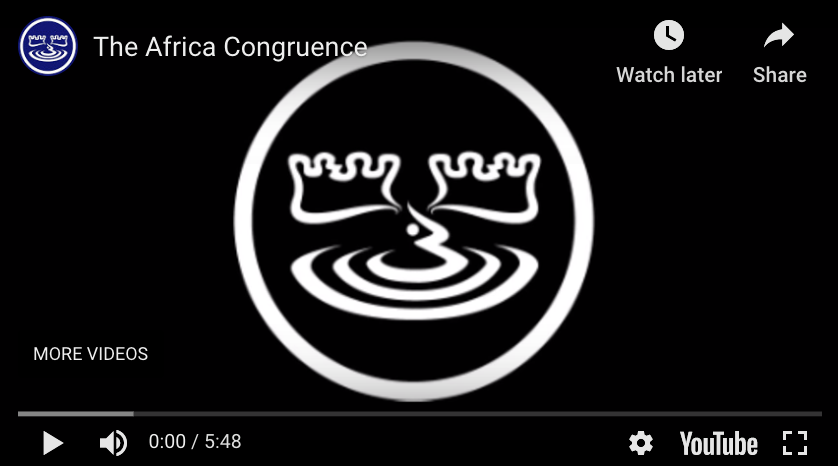

# The Mathematics of RSA Encryption
### The Africa Congruence Part II

This presentation has a simple goal: show you what's going on under the hood of encryption.

This presentation is the spiritual successor to the Africa Congruence video created by Bullmoose. Much of the math covered in that video is used in this presentation, but it is not a prerequisite.

    

